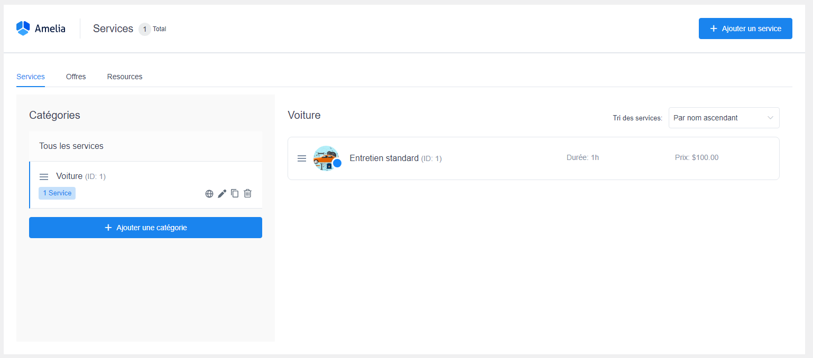

# Les services

Après avoir crée un employé(e), il est temps de mettre en place un rendez-vous afin de les proposer pour vos clients.


Les services sont comme des produits mise à la vente, et qui doivent être classés par catégorie.


Pour ajouter un service, il suffit de se rendre dans la section "Services"

<figure><figcaption>
Affichage des sections de l'extension
</figcaption></figure>

Ensuite, il faut créer différentes catégories afin de pouvoir créer un service et le catégoriser.

<figure><figcaption></figcaption></figure>

Et enfin, cliquer sur "Ajouter un service" et les informations nécessaires pour pouvoir l'afficher dans le catalogue.

Notamment, il faut indiquer aussi le prix et la durée, les photos du service, etc...

<figure><figcaption>
Informations du service à remplir
</figcaption></figure>

Après avoir complété, il suffit de l'enregistrer.

<figure><figcaption>
Affichage des services par catégorie
</figcaption></figure>


Pour percevoir les paiements des services, vous devez posséder obligatoirement l'extension "WooCommerce".


Maintenant il faut l'afficher dans l'une des pages du site, donc pour cela, il faut se rendre sur la documentation, et ensuite choisir l'affichage souhaité.

Les différents affichages sont expliqués sous cette image

<figure><figcaption></figcaption></figure>

* Booking Form -> Un formulaire de réservation à remplir
* Event List -> Un affichage des événements avec un détail complet
* Catalog -> Un affichage de tous les services par catégorie
* Step-by-Step -> Un affichage étape par étape

Chacun des formulaires peuvent être totalement personnalisable dans la section "Personnaliser"

<figure><figcaption>
Section pour personnaliser l'affichage
</figcaption></figure>
